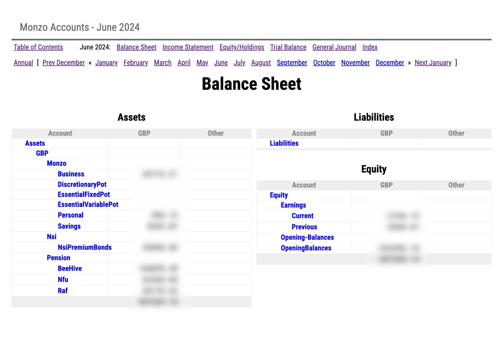

# Welcome to Monzo Beanount



[Monzo bank](https://monzo.com/) offers a feature that allows users to export their transaction data directly to Google Sheets. This
integration simplifies the process of tracking and analyzing personal finances by automatically updating
a Google Sheet with real-time transaction details. Users can set up this feature through the Monzo app,
enabling seamless synchronization of their banking transactions with their spreadsheet.

[Beancount](https://beancount.github.io/docs/the_double_entry_counting_method.html) is a text-based double-entry
accounting system that facilitates precise tracking of financial
transactions using a straightforward and readable format. Each transaction in Beancount involves at least
two accounts—one is debited and the other credited—ensuring that the accounting equation (Assets = Liabilities + Equity)
is always balanced. The system supports multiple currencies and commodities, and can generate
comprehensive financial reports such as balance sheets and income statements. Beancount's plain text
files are easy to edit with any text editor, and its functionality can be extended with plugins
for custom features or data integration. This makes Beancount ideal for both personal finance management
and small business accounting.

**Monzo Beancount** is a command line interface app that leverages the Monzo-Google Sheets integration to generate Beancount
accounting files from Monzo transaction data. The tool reads transaction details from a Google Sheet,
converts them into Beancount transactions, and writes the transactions to a Beancount file. This
enables Monzo users to maintain accurate financial records in Beancount format without manual data entry.

## Usage

```shell
> monzo-beancount init # initialises the file system in the home directory
> cd ~/beancount
> monzo-beancount generate # (re)generates the main Beancount file
> bean-check main.beancount # checks the file for errors
> bean-web main.beancount # starts the web server
> (open URL: http://localhost:8080)
```
